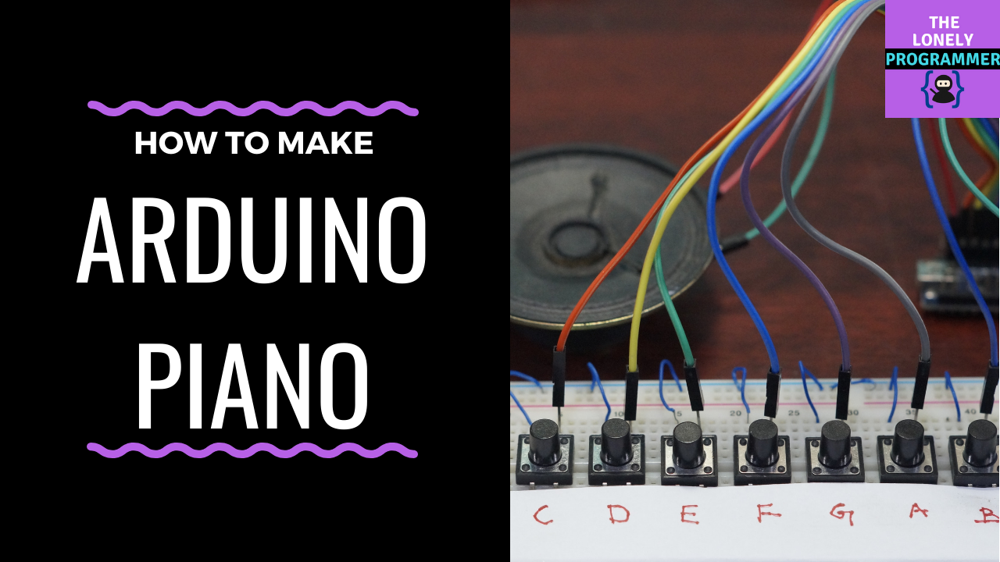
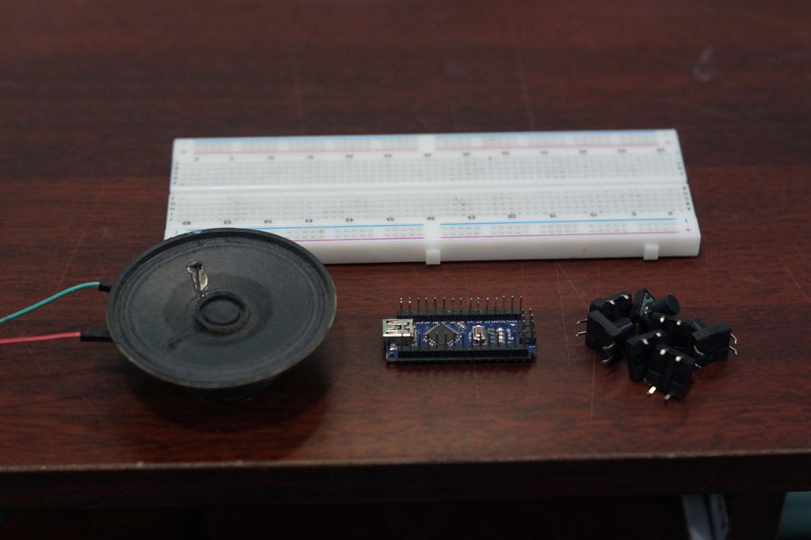
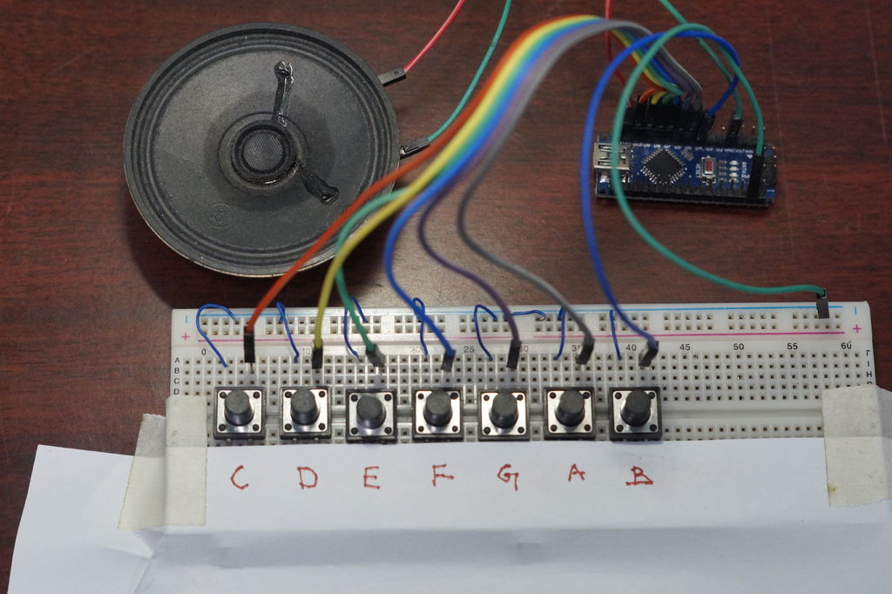

# Mini-Piano

In this tutorial, Let's see how to make a mini piano using Arduino Nano. 

## Requirements

### Hardware

* Arduino Nano
* Piezo Buzzer or Speaker
* Push button x 7
* Jumper cables

### Software

*   Arduino IDE
*   Arduino Tone Library

## Connections

The Button are connected to D4 to D10 pins of Arduino Nano
Piezo Buzzer is connected to D11 pin of Arduino Nano

| Button / Buzzer            |  Arduino Nano  |
|-----------------------|---------------|
| Button 1 |  D4 |
| Button 2 |  D5 |
| Button 3 |  D6 |
| Button 4 |  D7 |
| Button 5 |  D8 |
| Button 6 |  D9 |
| Button 7 |  D10 |
| Buzzer |  D11 |

## The Code

Before you can start playing your piano, you will need to obtain and install the Tone Arduino library if it is not already installed. This can be downloaded from Github here. If you do not know how to install third-party Arduino libraries in your version of the Arduino IDE, reference this guide on Arduino.cc. Attached below, you will find a zip file that contains the Arduino code for Arduino Piano. Download it and unzip it somewhere on your computer. Open Arduino_Piano.ino in the Arduino IDE and upload the code to your Arduino.

Project Repo: https://github.com/Rahul24-06/Mini-Piano/

## Play Time!

And thats it! You should now be able to tap on the keys and hear the corresponding notes played through the buzzer. If the note isn't accurate, you can adjust the note value in the Arduino sketch to set what value that the pitch is achieved.You can also change the scale that is played by uncommenting one of the few scales included, or make your own scale! If you make your own piano, please comment and show us some pictures and videos. https://youtu.be/niiFx9eiCZk

*If you faced any issues in building this project, feel free to ask me. Please do suggest new projects that you want me to do next.*

*Share this video if you like.*

*Happy to have you subscribed: https://www.youtube.com/c/rahulkhanna24june?sub_confirmation=1*

**Thanks for reading!**
